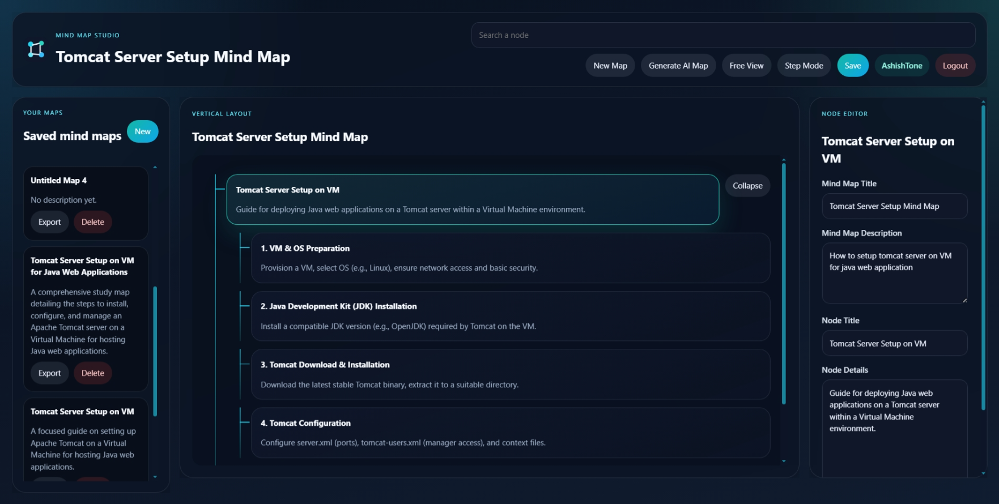

# 🧠 Mind Map Study App

A full-stack MERN-based application to create, manage, and visualize study mind maps with AI-powered generation.

---

## 🚀 Features

* 🧠 Create & Edit Mind Maps
* 🌳 Tree-based visualization
* 🤖 AI-generated mind maps (Gemini API)
* 💾 Save & Load maps from database
* 🔍 Search nodes
* 🎯 Step-by-step presentation mode
* 📁 Export mind maps

---

## 🛠️ Tech Stack

### Frontend

* React (Vite)
* Zustand (State Management)
* React Query

### Backend

* Node.js
* Express.js
* MongoDB (Mongoose)

---

## 📂 Project Structure

```
/backend
  /src
    /controllers
    /models
    /routes
    /services
    /utils

/frontend
  /src
    /components
    /pages
    /hooks
```

---

## ⚙️ Setup Instructions

### 1️⃣ Clone Repository

```bash
git clone https://github.com/AshishTone/mind-map-app.git
cd mind-map-app
```

---

### 2️⃣ Backend Setup

```bash
cd backend
npm install
```

Create `.env` file:

```
MONGODB_URI=your_mongodb_url
PORT=5000
CLIENT_ORIGIN=http://localhost:5173
GEMINI_API_KEY=your_api_key
```

Run backend:

```bash
npm run dev
```

---

### 3️⃣ Frontend Setup

```bash
cd frontend
npm install
npm run dev
```

---

## 🌐 API Endpoints

### Auth

* POST `/api/auth/signup`
* POST `/api/auth/login`

### Mind Maps

* GET `/api/maps`
* POST `/api/maps`
* PUT `/api/maps/:id`
* DELETE `/api/maps/:id`
* POST `/api/maps/generate`

---

## 📸 Screenshots


---

